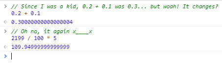
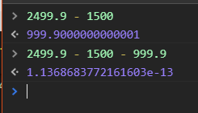
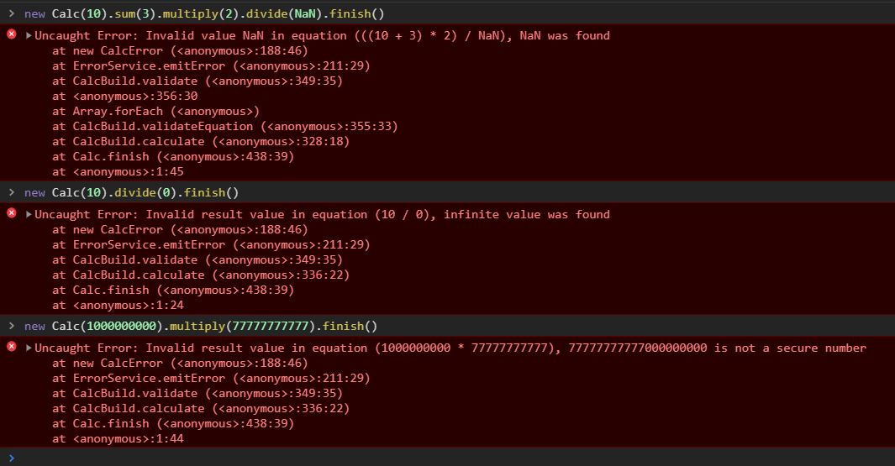

# Calc JS
Handle JavaScript operations, avoiding the native problems of the language.
> javescripeto le calco

[](https://badge.fury.io/js/calc-js)
[](https://github.com/lordazzi/calc-js)
[](https://github.com/lordazzi/calc-js)
[](https://travis-ci.org/lordazzi/calc-js)
[](https://github.com/lordazzi/calc-js/blob/documentation/LICENSE)

## The problem
The problem of representing decimal numbers encoded in IEEE 754 binary format is a problem that JavaScript suffers.
The bug consists of the lack of ability for the format to represent some numerical values in the binary format, you can read an article talking about it here:  [Double precision floating-point](https://en.wikipedia.org/wiki/Double-precision_floating-point_format).

This is a well-known problem, in Java they have developed a class called BigDecimal to solve this.





The problem is generated when you perform a simple calculation using some decimal values, example:
```javascript
0.2 + 0.1 = 0.30000000000000004
```

But the same problem does not occur when the same result is reached using powers of 10, example:
```javascript
3 / 10 = 0.3
```

## Instalation
```sh
npm install calc-js --save
```

```javascript
//  node
var Calc = require('calc-js').Calc;
```

```html
<!-- browser -->
<script src="calc-js/calc.latest.min.js"></script>
```

```typescript
//  typescript
import { Calc } from 'calc-js';
```

## How to use
The use of the library is very simple:

```typescript
import { Calc } from 'calc-js';

// 0.2 + 0.1
const numericResult = new Calc(0.2).sum(0.1).finish();

// 0.2 - 0.1
const numericResult = new Calc(0.2).minus(0.1).finish();

// 2199 / 100 * 5
const numericResult = new Calc(2199).divide(100).multiply(5).finish();
```

This is an example with TypeScript, but you can also use this in JavaScript application as you wish.

## Error Handling
There are some EcmaScript errors that are not thrown by the language and it cannot be treated,
these erros are: zero division and infinity numbers `0 / 10 = Infinity`, non numberic math
operations `'Some text' * 10 = NaN` and insecure numbers (too large number that language cannot
represent, but still allow you to use then).

The library will generate an error object when these situations are found, this is the CalcError
and it extends native JavaScript Error. Use this will give you a stack trace to found the problem cause.



You can choose four ways to deal with errors:

### 1. Ignore then
Ignore all identified errors
```typescript
Calc.configure({
  throwNaN: false,
  throwInfinite: false,
  throwUnsafeNumber: false
});
```

### 2. Listen an event
Register a function on library to listen all thrown errors. This will cover
all Calc in application so, is a centralized treatment

```typescript
Calc.configure({
  // you don't need really configure this, 'emit-event' is the default value
  thrownStrategy: 'emit-event'
});

Calc.onError(function(error) {
  //  do something
});
```
Note: if you choose emit-event and don't associate any function to listen the errors,
the application will thrown then

### 3. Throw
This is a non centralized solution. You'll use this when the calc is critical
and should not generate an invalid result.

```typescript
Calc.configure({
  thrownStrategy: 'thrown'
});

try {
  const result = new Calc(10).sum(11).finish();
} catch (e) {
  //  do something
}
```

### 4. Show in console
This will write the error in the browser console

```typescript
Calc.configure({
  thrownStrategy: 'console'
});
```

## Config
All library settings are related to how errors will be thrown. The following exemple show
how to change these configs and show the default values set in the library:

```typescript
Calc.configure({
  thrownStrategy: 'emit-event',
  throwNaN: true,
  throwInfinite: true,
  throwUnsafeNumber: true
});
```

This configure function will override the default values to each Calc execution
in your application, but these default values can be overriden in each execution
(configure localy will never required, but optional):

```typescript
const localConfig = { thrownStrategy: 'thrown' };
new Calc(10, localConfig).divide(0).finish();
```

```typescript
const localConfig = { thrownStrategy: 'thrown' };
//  the old way to calc in the library
Calc.divide(10, 0, localConfig);
```

```typescript
const localConfig = { thrownStrategy: 'thrown' };
//  it will throw if this isn't a valid number
Calc.checkNumber(Infinity, 'Validating data from query param', localConfig);
```

## Contributing

### 1. Create an issue
No one feature will be implemented without it having an open issue and without which the proposed has been accepted by the team responsible for the project. After the issue is approved, the applicant, a team member or anyone else can open a pull request associated with that issue (just paste the issue link in the pull request).

### 2. Did you find a bug?
When logging a bug, please be sure to include the following:
 * The library version;
 * If at all possible, an *isolated* way to reproduce the behavior;
 * The behavior you expect to see, and the actual behavior.

You can try to update the library to the last version to see if the bug has already been fixed.

### 3. Do not create a duplicate issue
[Search the existing issues](https://github.com/lordazzi/calc-js/search?type=Issues) before logging a new one.

Some search tips:
 * *Don't* restrict your search to only open issues. An issue with a title similar to yours may have been closed as a duplicate of one with a less-findable title.
 * Check for synonyms. For example, if your bug involves an interface, it likely also occurs with type aliases or classes.

### 4. Create a Pull Request
Follow the steps:

 * Create a [fork](https://guides.github.com/activities/forking/) from our repository by [clicking here](https://github.com/lordazzi/calc-js/fork), install [node](https://nodejs.org/), do a `git clone` of your forked repository and run `npm install` in the application folder;
 * Create a branch in your forked repository, then code the feature or fix the bug;
 * Run `npm run lint`, `npm run test` and `npm run build` in the repository;
 * Create a Pull Request from your repository to this one, with the issue in the body and some information you think could be usefull to the reviewer (print or a [gif of it working](https://www.screentogif.com/) will be appreciated);
 * The reviewer can ask some changes, don't be mad, this is the GIT Flow process;
 * You get approved and your branch with the feature / fix 